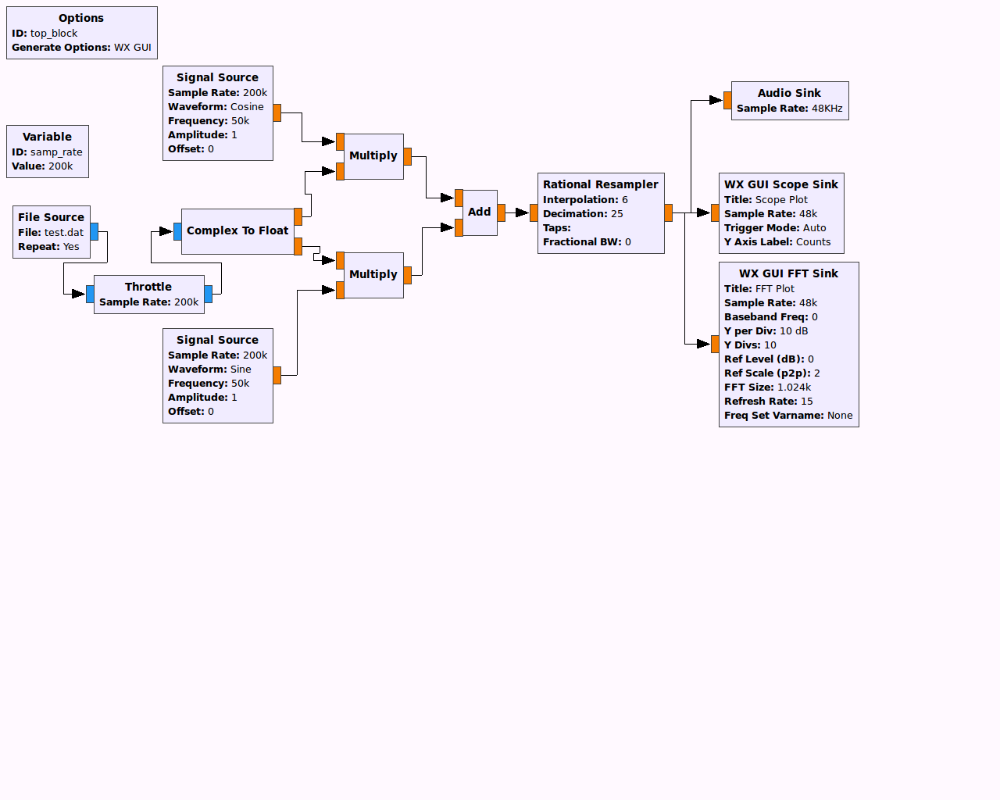

# GNU Radio amateur radio examples

## Red Pitaya

[RedPitaya]{.title-ref} contains code for [Red
Pitaya](https://www.scivision.dev/red-pitaya-gnuradio-setup)
[PiRadar](https://www.scivision.dev/pi-radar).

## SSB Examples

First we start with the most basic example of SSB. This example lacks
the filtering normally used with these methods to be as minimal as
possible. They work via files recorded to disk using your computer\'s
microphone.

There are numerous references for SSB transmitters and receivers, such
as the ARRL Handbook, or the [Philips AN1981 application
note](http://www.nxp.com/documents/application_note/an1981.pdf). In
AN1981, Fig. 8 shows the Weaver method receiver (note I only use the
part to the right of the filters, since I didn\'t use filtering). In
AN1981, Fig. 5 shows the Phasing method transmitter. In both cases,
ignore the divide-by-4 of AN1981 as that\'s peculiar to their system.

### Simplest synthethic SSB simulation

This simulation doesn\'t use any filters, and so would never work in the
real world unless there were no other transmissions within a few octaves
of your sampling bandwidth. You can see in the FFT scope on transmit
that it is indeed USB transmission.

The first example uses the phasing method to transmit on a synthetic 50
kHz carrier frequency Fc, upper sideband only. Next, you receive this
Fc=50 kHz USB transmission using a Weaver method SSB receiver.

The noise floor on transmit extends from Fc to Fc+24 kHz as that\'s 1/2
the bandwidth of your 48kHz sound card. You can transmit some
hi-fidelity SSB audio of DC to 24kHz, limited by your PC microphone and
speakers. You may hear some background crackling and aliasing artifacts
due to no digital filtering used, but overall the audio should be
relatively clear.

You can see the reference material to add the appropriate filters to
these examples as an exercise.

1.  Open and Run ssbTXhilbert.grc in GNU Radio Companion. This records
    your voice via your computer microphone to a file \$HOME/test.dat.
    This file is complex float data. Hit Stop to stop recording.
2.  Open and Run ssbRX.grc in GNU Radio Companion. This loops back your
    voice through your computer speakers.

